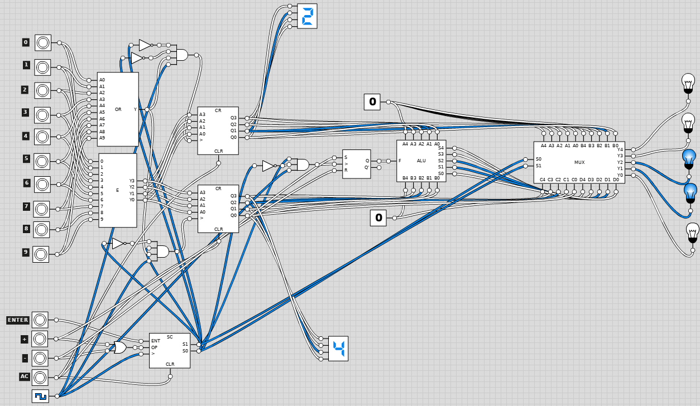

# Logic-Gate-Calculator
A 5-bit, two's complement calculator that performs addition and subtraction. Made from basic digital building blocks and gates.

# Logicly Model
To test the computer model Calculator.logicly under schematics/, go to https://logic.ly/ and use the free online editor or download the software. The schematics for each of the components and sub components descriped in the "Components" section below can also be found in the schematics/ directory.

# Usage
The calculator only performs operations on sigle digit decimal numbers ([0, 9]) and outputs results in a 5-bit two's complemet format. Since the largest positive number that can be represented is 15, when the output is greater than 15, the calculator outputs -32 to indicate overflow.
## Instructions
  1. Select the first operand
  2. Press enter
  3. Select the second operand
  4. Press enter
  5. Select the operation (+/-)
  6. Press AC to restart

# Components
## State Controller (SC)
A Moore Finite State Machine that controlls what gets displayed and when the first and second operands are stored. A handwritten state diagram can be found under diagrams/
## ALU
The Arithmetic Logic Unit (ALU) implements addition and subtration of 5-bit numbers using two's complement notation.
## Input Encoder (E)
Encoder that translates the button representing a number pressed to its corresponding a 4-bit binary representation (no two's complement).
## Register (CR)
A 4-bit register made of D-flip-flops that stores a number
## 5-bit 4:1 Multiplexer (MUX)
Mux that controlls which number (0, first operand, second operand, or result) gets displayed.
## 10-input OR Gate (OR)
OR gate that checks whether any of the 10 digits is being pressed.

